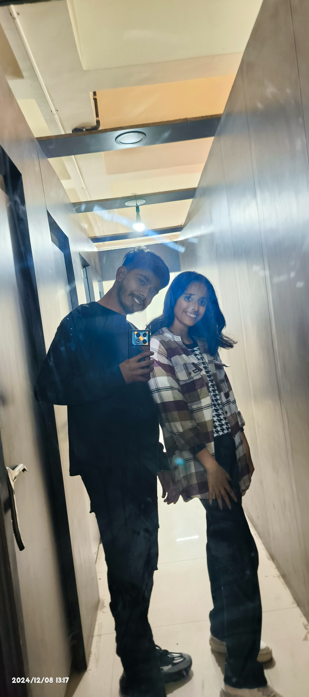

[index.html](https://github.com/user-attachments/files/27105592/index.html)
<!DOCTYPE html>
<html lang="en">
<head>
    <meta charset="UTF-8">
    <title>For My Love ❤️</title>
    <link rel="stylesheet" href="style.css">
</head>
<body>

<!-- Navbar -->
<nav class="navbar">
    <h1 class="logo">❤️ My Love Mohini Kashyap</h1>
    <ul>
        <li onclick="scrollToSection('home')">Home</li>
        <li onclick="scrollToSection('memories')">Memories</li>
        <li onclick="scrollToSection('videos')">Videos</li>
        <li onclick="scrollToSection('message')">Message</li>
    </ul>
</nav>

<!-- Hero Section -->
<section id="home" class="section hero">
    <h2 class="fade-in">You Are My Everything I can't live without you you are my everything💕</h2>
    
This is only for you Baby❤️

</section>

<!-- Memories -->
<section id="memories" class="section">
    <h2>Our Memories 📸</h2>
    

        
        
        
    

</section>

<!-- Videos -->
<section id="videos" class="section">
    <h2>Special Videos 🎥</h2>
    <video controls>
        <source src="mohini 2.0 video .mp4" type="video/mp4">
    </video>
</section>

<!-- Message -->
<section id="message" class="section message">
    <h2>My Message 💌</h2>
    

    <button onclick="showLove()">Click Me ❤️</button>
</section>

</body>
</html>
